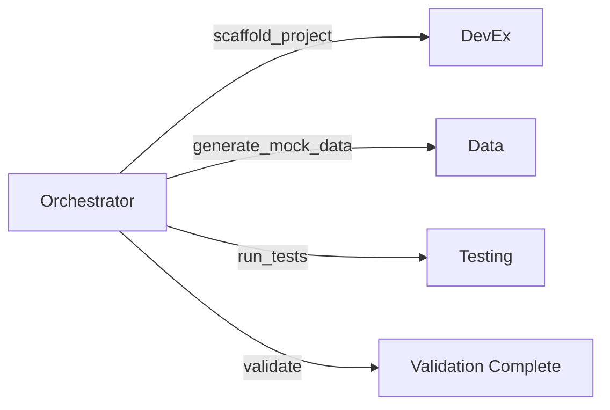

# 7-Agent Architecture - Integration Plan

**Status:** In Progress  
**Created:** 2025-12-04  
**Target Completion:** 2025-12-06  

---

## 📊 Current Status Analysis

### ✅ **What's Built (Infrastructure Layer)**

1. **Base Agent Framework** (`base_agent.py`) - ✅ Complete
   - Event-driven communication via Redis
   - Skill registration system
   - Inter-agent communication (`call_skill()`)
   - Graceful shutdown handling
   - Error handling & logging

2. **7 Specialized Agents** - ✅ Code Complete
   - **Testing Agent** (11,716 bytes) - Test execution, chaos engineering, benchmarking
   - **Data Agent** (13,634 bytes) - Mock data generation, database seeding
   - **DevEx Agent** (11,467 bytes) - Dev server, debugging, profiling
   - **Documentation Agent** - Doc generation & validation
   - **Orchestration Agent** (10,954 bytes) - Workflow coordination
   - **Infrastructure Agent** - Docker & CI/CD management
   - **UI Agent** - Frontend component generation

3. **Docker Configuration** (`docker-compose.agents.yml`) - ✅ Complete
   - All 7 agents with proper networking
   - PostgreSQL & Redis infrastructure
   - Resource limits defined
   - Health checks configured

### ⚠️ **Known Gaps & Issues**

#### 1. **Event Bus Integration** 🔴 CRITICAL

**Problem:** Base agent tries to import `src.events.bus.EventBus` but this class may not be fully compatible with agent requirements.

**Evidence:**

```python
# base_agent.py line 386-388
from src.events.bus import EventBus
```

**Required Actions:**

- Verify `EventBus.subscribe()` signature matches agent expectations
- Ensure Redis connection pooling works in containerized environment
- Test pub/sub pattern with correlation IDs

#### 2. **Memory System Integration** 🟡 MEDIUM

**Problem:** Memory system is mocked/optional in agents but should be integrated.

**Evidence:**

```python
# base_agent.py line 415-416
memory = None  # Placeholder for now
```

**Required Actions:**

- Connect agents to 4-layer memory system
- Implement agent-specific memory contexts
- Add memory persistence for agent state

#### 3. **Missing Helper Modules** 🟡 MEDIUM

Several agents reference helper modules that may be incomplete:

- `agents/testing/chaos_scenarios.py`
- `agents/testing/performance_monitor.py`
- `agents/devex/debug_tools.py`
- `agents/data/mock_generator.py`

**Required Actions:**

- Verify all referenced modules exist
- Implement missing modules or stub them
- Add comprehensive error handling

#### 4. **Orchestration Dependencies** 🟡 MEDIUM

**Problem:** Orchestration agent declares hard dependencies on all other agents.

**Evidence:**

```yaml
# docker-compose.agents.yml lines 133-138
depends_on:
  - agent-testing
  - agent-devex
  - agent-data
  # ... all others
```

**Issue:** If any single agent fails, orchestration won't start.

**Required Actions:**

- Make dependencies soft (use health checks instead)
- Implement dynamic agent discovery
- Add graceful degradation

---

## 🎯 Integration Roadmap

### **Phase 1: Foundation (Day 1)** 🔧

**Goal:** Get all 7 agents running and communicating

#### Task 1.1: Event Bus Verification ✓ CHECK

**Duration:** 1-2 hours  
**Owner:** You + AI

**Steps:**

1. Review `src/events/bus.py` implementation
2. Verify subscribe/publish methods match agent requirements
3. Test Redis connection in Docker environment
4. Create simple ping/pong test between 2 agents

**Acceptance Criteria:**

- [ ] All agents can connect to Redis
- [ ] Pub/sub communication works
- [ ] Correlation IDs are preserved

**Test Command:**

```bash
docker compose -f docker-compose.agents.yml up postgres redis agent-testing
# Check logs for successful EventBus connection
docker logs archon-agent-testing
```

#### Task 1.2: Agent Startup Validation ✓ CHECK

**Duration:** 2-3 hours

**Steps:**

1. Start agents one by one
2. Check for import errors
3. Verify each agent registers skills
4. Monitor Redis for published startup events

**For Each Agent:**

```bash
docker compose -f docker-compose.agents.yml up -d <agent-name>
docker logs archon-agent-<name> --tail 50
# Look for: "[<agent_id>] Agent started and listening for events"
```

**Expected Startup Log:**

```
[testing] Agent initialized with 6 skills
[testing] Agent started and listening for events
[testing] Successfully published status: started
```

#### Task 1.3: Fix Import Errors 🔧 FIX

**Duration:** 1-2 hours

**Common Issues:**

- Missing helper modules
- PYTHONPATH issues
- Circular imports

**Fix Strategy:**

1. Use grep to find all `import` statements
2. Verify each module exists
3. Add missing `__init__.py` files
4. Stub incomplete modules

**Commands:**

```bash
# Find all imports in agents
grep -r "^from agents" python/agents/*/agent.py

# Check which helper modules are missing
find python/agents -name "*.py" -type f
```

---

### **Phase 2: Agent Communication (Day 2)** 🔗

**Goal:** Verify inter-agent skill calls work

#### Task 2.1: Create Integration Tests

**Duration:** 2-3 hours

**Test Scenarios:**

1. **Orchestrator → Testing Agent**
   - Orchestrator calls `testing.run_tests`
   - Verify response received

2. **Testing Agent → Data Agent**
   - Testing requests mock data via `data.generate_mock_data`

3. **DevEx Agent → All Agents**
   - DevEx queries status of all agents
   - Verifies skill discovery

**Test File:** `python/tests/integration/test_agent_communication.py`

```python
async def test_orchestrator_calls_testing():
    """Test Orchestrator → Testing Agent skill call"""
    # Setup
    orchestrator = get_agent("orchestration")
    
    # Execute
    result = await orchestrator.call_skill(
        "testing",
        "run_tests",
        {"suites": ["unit"], "coverage": False}
    )
    
    # Verify
    assert result["status"] == "success"
    assert "tests_run" in result
```

#### Task 2.2: End-to-End Workflow Test

**Duration:** 2 hours

**Workflow:** "Create Agent with Full Testing"



**Implementation:**

```python
workflow = {
    "name": "create_and_test_agent",
    "steps": [
        {"agent": "devex", "skill": "scaffold_project", "params": {"name": "test-agent"}},
        {"agent": "data", "skill": "generate_mock_data", "params": {"entity_type": "users", "count": 5}},
        {"agent": "testing", "skill": "run_tests", "params": {"suite": "integration"}}
    ]
}

result = await orchestrator.execute_workflow(workflow, mode="sequential")
```

---

### **Phase 3: Production Readiness (Day 3)** 🚀

**Goal:** Make agents production-ready

#### Task 3.1: Health Checks & Monitoring

**Duration:** 2-3 hours

**Add to each agent:**

1. Health check endpoint
2. Prometheus metrics
3. Structured logging

**Example Health Check:**

```python
# In each agent class
async def health_check(self) -> Dict[str, Any]:
    return {
        "agent_id": self.agent_id,
        "status": "healthy" if self._running else "stopped",
        "uptime": self._uptime(),
        "skills_count": len(self.skills),
        "event_bus_connected": await self.event_bus.is_connected()
    }
```

#### Task 3.2: Error Recovery

**Duration:** 2 hours

**Implement:**

1. Automatic reconnection to Redis
2. Dead letter queue for failed events
3. Circuit breakers for failing agents

**Priority Areas:**

- EventBus connection failures
- Skill execution timeouts
- Memory allocation failures

#### Task 3.3: Documentation & Examples

**Duration:** 1-2 hours

**Create:**

1. Agent skill catalog (markdown)
2. Example workflows (5+ scenarios)
3. Troubleshooting guide

---

## 📋 Task Checklist

### Phase 1: Foundation

- [ ] **P0** Verify EventBus compatibility
- [ ] **P0** Start all 7 agents successfully
- [ ] **P0** Fix all import errors
- [ ] **P1** Verify skills are registered
- [ ] **P1** Test Redis pub/sub manually

### Phase 2: Communication

- [ ] **P0** Create inter-agent communication tests
- [ ] **P0** Test Orchestrator → Testing Agent
- [ ] **P0** Test Data Agent mock generation
- [ ] **P1** Execute end-to-end workflow
- [ ] **P1** Validate correlation IDs

### Phase 3: Production

- [ ] **P1** Add health checks to all agents
- [ ] **P1** Implement error recovery
- [ ] **P2** Add Prometheus metrics
- [ ] **P2** Create documentation
- [ ] **P2** Write example workflows

---

## 🔍 Validation Criteria

### Agent Integration is COMPLETE when

✅ All 7 agents start without errors  
✅ EventBus pub/sub works between all agents  
✅ Orchestrator can discover and call all skills  
✅ At least 3 end-to-end workflows execute successfully  
✅ Agents survive Redis restart (auto-reconnect)  
✅ All agents have health check endpoints  
✅ Documentation includes skill catalog and examples  

---

## 🚨 Known Risks

| Risk | Impact | Mitigation |
|------|--------|------------|
| EventBus incompatibility | HIGH | Test early, add adapter layer if needed |
| Missing helper modules | MEDIUM | Stub incomplete modules, add TODOs |
| Redis connection issues | MEDIUM | Add connection pooling, retry logic |
| Circular dependencies | LOW | Use lazy imports, dependency injection |
| Docker networking issues | LOW | Use docker-compose networking, test locally |

---

## 📊 Progress Tracking

**Current Phase:** Phase 1 (Foundation)  
**Completion:** 0% (Infrastructure built, not tested)

**Daily Updates:**

- **2025-12-04:** Plan created, infrastructure analysis complete
- **2025-12-05:** TBD
- **2025-12-06:** TBD

---

## 🎯 Next Immediate Actions

1. **START Docker Desktop** (if not running)
2. **Run:** `docker compose -f docker-compose.agents.yml up -d postgres redis`
3. **Verify:** Redis & Postgres are healthy
4. **Start:** `agent-testing` first (simplest dependencies)
5. **Debug:** Any import errors
6. **Test:** Send manual pub/sub event via Redis CLI
7. **Iterate:** Fix issues, move to next agent

**First Command to Run:**

```bash
# Start infrastructure
docker compose -f docker-compose.agents.yml up -d postgres redis

# Wait 10 seconds
sleep 10

# Start testing agent (has fewest dependencies)
docker compose -f docker-compose.agents.yml up agent-testing

# In another terminal, check logs
docker logs archon-agent-testing -f
```

---

**Last Updated:** 2025-12-04 16:40:40
**Next Review:** After Phase 1 completion
