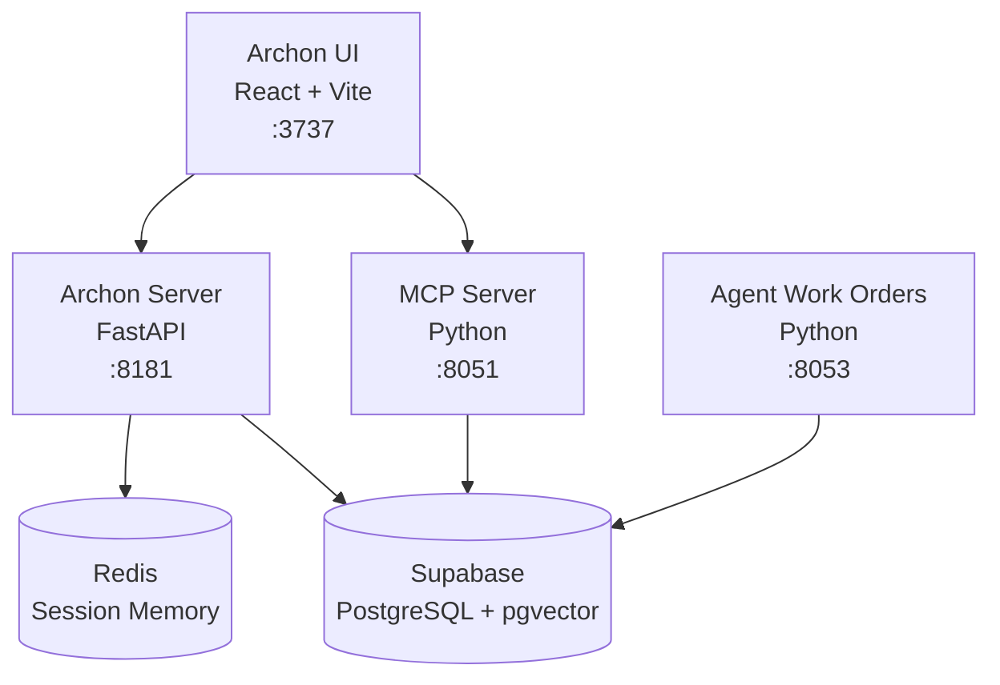

# 🏛️ ARCHON SYSTEM OVERVIEW

**Version:** 1.0.0  
**Last Updated:** 2025-12-02  
**Status:** Production-Ready (UI & Backend Operational)

---

## 📋 Document Purpose

This document provides a comprehensive overview of the Archon system for external AI consultants and collaborators. It describes the system's purpose, architecture, components, capabilities, and current status.

**Target Audience:** AI assistants (Claude, GPT, Gemini, etc.) providing consultation or development support.

---

## 🎯 System Purpose

**Archon** is a **Model Context Protocol (MCP) Server** that acts as a **Command Center for AI Coding Assistants**. It provides:

1. **Persistent Memory** - Retain context across sessions (Session, Working, Long-Term layers)
2. **Knowledge Management** - Web crawling, document processing, RAG (Retrieval Augmented Generation)
3. **Task Management** - Project and task tracking for AI agents
4. **Real-Time Synchronization** - Event-driven architecture with WebSocket support
5. **Agent Orchestration** - Workflow builder and agent work orders

**Vision:** Enable users to create production-ready AI agents in minutes, with persistent memory and knowledge that survives across sessions and models.

---

## 🏗️ Architecture Overview

### Microservices Stack

Archon uses a **microservices architecture** with the following components:



### Core Services

| Service | Technology | Port | Purpose |
|---------|-----------|------|---------|
| **archon-ui** | React 18 + Vite + TailwindCSS | 3737 | Web-based UI for memory inspection, knowledge base, projects |
| **archon-server** | FastAPI + Python 3.12 | 8181 | REST API, business logic, orchestration |
| **archon-mcp** | Python MCP SDK | 8051 | Model Context Protocol server (Claude integration) |
| **archon-agent-work-orders** | Python + Claude CLI | 8053 | Autonomous agent execution system |
| **archon-redis** | Redis Alpine | 6379 | Session memory (short-term) |
| **supabase** | PostgreSQL + pgvector | External | Working & Long-Term memory, vector search |

---

## 💾 Memory System

Archon implements a **4-layer memory architecture**:

### 1. Session Memory (Redis)
- **Retention:** Current session only
- **Storage:** Redis (in-memory)
- **Purpose:** Conversation history, immediate context
- **API:** `/api/memory/session/{session_id}`

### 2. Working Memory (Supabase)
- **Retention:** 7-30 days
- **Storage:** PostgreSQL
- **Purpose:** Recent tasks, active context, temporary facts
- **API:** `/api/memory/working?user_id={uuid}`

### 3. Long-Term Memory (Supabase)
- **Retention:** Permanent
- **Storage:** PostgreSQL
- **Purpose:** Important facts, user preferences, learned patterns
- **API:** `/api/memory/longterm?user_id={uuid}`

### 4. Knowledge Base (Supabase + pgvector)
- **Retention:** Permanent
- **Storage:** PostgreSQL with pgvector extension
- **Purpose:** Crawled documentation, uploaded documents, RAG embeddings
- **API:** `/api/knowledge/*`

---

## 🔧 Key Features

### ✅ Implemented & Operational

1. **Memory Inspector UI**
   - View session conversation history
   - Browse working memory entries
   - Explore long-term knowledge
   - Memory statistics dashboard

2. **Knowledge Base**
   - Web crawler (Playwright-based)
   - Document upload & processing
   - Vector search with embeddings
   - RAG-powered query answering

3. **Project & Task Management**
   - Create and organize projects
   - Task tracking with status
   - GitHub repository integration

4. **Event System**
   - Pub/Sub architecture (Redis)
   - Real-time notifications
   - Event logging and audit trail

5. **Agent Work Orders** (Beta)
   - Claude Code integration
   - Autonomous PR creation
   - Git worktree isolation

### 🚧 In Development

6. **Workflow Builder** (UI exists, backend in progress)
   - Visual workflow designer
   - Node-based agent orchestration

7. **Observability Dashboard**
   - System health monitoring
   - Performance metrics

---

## 🚀 Getting Started

### Prerequisites
- Docker & Docker Compose
- Supabase account (for database)
- Optional: OpenAI API key (for RAG features)
- Optional: GitHub PAT (for agent work orders)

### Quick Start

```bash
# 1. Clone repository
cd /path/to/Archon

# 2. Configure environment
cp .env.example .env
# Edit .env with your SUPABASE_URL and SUPABASE_SERVICE_KEY

# 3. Start services
docker compose up -d

# 4. Access UI
open http://localhost:3737
```

### Service Endpoints
- **UI:** http://localhost:3737
- **Server API:** http://localhost:8181
- **MCP Server:** http://localhost:8051
- **Agent Work Orders:** http://localhost:8053

---

## 📊 Current Status (2025-12-02)

### ✅ Recently Completed Milestones

1. **Memory Inspector Fully Functional** (2025-12-02)
   - Fixed all backend API errors
   - Resolved frontend UUID validation
   - Created test data seed script
   - All memory layers operational

2. **UI Stabilization** (2025-12-01)
   - Fixed white screen issue (container rebuild)
   - Resolved Vite source file loading
   - Bug Report modal functional
   - All Docker containers healthy

3. **AI Development Standards** (2025-12-01)
   - Created `AI_INSTRUCTIONS.md` (mandatory protocol)
   - Created `AI_WORK_LOG.md` (session tracking)
   - Created `AI_TASKS.md` (persistent task list)
   - Created `.context/` directory (decisions, state)

### 🎯 Active Development Areas

1. **Workflow Builder Backend**
   - UI components ready
   - Need workflow execution engine

2. **Memory Data Population**
   - Test data exists for Session memory
   - Need to populate Working & Long-Term layers

3. **Agent Work Orders Stability**
   - Core functionality works
   - Needs error handling improvements

---

## 🗂️ Project Structure

```
Archon/
├── python/                          # Backend services
│   ├── src/
│   │   ├── server/                 # FastAPI server
│   │   ├── mcp_server/             # MCP protocol implementation
│   │   ├── agent_work_orders/      # Agent execution
│   │   ├── memory/                 # Memory layer implementations
│   │   ├── events/                 # Event bus system
│   │   └── api/                    # API routes
│   ├── Dockerfile.server
│   ├── Dockerfile.mcp
│   ├── Dockerfile.agent-work-orders
│   └── pyproject.toml              # Python dependencies
│
├── archon-ui-main/                 # Frontend application
│   ├── src/
│   │   ├── features/               # Feature modules
│   │   ├── components/             # Reusable components
│   │   ├── services/               # API clients
│   │   └── pages/                  # Page components
│   ├── package.json
│   └── vite.config.ts
│
├── docker-compose.yml              # Service orchestration
├── .env                            # Configuration (not in git)
├── README.md                       # Quick start guide
├── VISION.md                       # Long-term vision
├── SAAS_ROADMAP.md                # SaaS transformation plan
├── CONTRIBUTING.md                 # Development guidelines
│
├── AI_INSTRUCTIONS.md              # 🤖 AI Protocol (MANDATORY READ)
├── AI_WORK_LOG.md                  # 📝 AI Session Log
├── AI_TASKS.md                     # 📋 Persistent Task List
└── .context/                       # 📂 AI Context Storage
    ├── current_state.md            # System status
    └── decisions.md                # Architectural decisions
```

---

## 🤖 AI Development Protocol

**CRITICAL:** All AI assistants working on Archon **MUST** follow `AI_INSTRUCTIONS.md`.

### Mandatory Initialization Sequence
1. Read `AI_WORK_LOG.md` (last 2-3 entries)
2. Read `AI_TASKS.md` (current priorities)
3. Read `.context/current_state.md` (system health)
4. Read `.context/decisions.md` (architectural context)

### Documentation Requirements
- Log all work in `AI_WORK_LOG.md`
- Update `AI_TASKS.md` when starting/completing tasks
- Update `.context/current_state.md` when fixing bugs
- Update `ARCHON_SYSTEM_OVERVIEW.md` for major milestones **(THIS FILE)**

---

## 📈 Key Metrics

### System Health (as of 2025-12-02)
- ✅ All 5 Docker containers: **Healthy**
- ✅ UI Response Time: **< 100ms**
- ✅ API Uptime: **Stable**
- ✅ Memory API: **Fully Functional**

### Test Data
- **Test User ID:** `550e8400-e29b-41d4-a716-446655440000`
- **Test Session ID:** `test_session_001`
- **Session Messages:** 6 sample conversations

---

## 🔐 Security & Configuration

### Environment Variables (Required)
```bash
# Database
SUPABASE_URL=https://your-project.supabase.co
SUPABASE_SERVICE_KEY=your-service-role-key

# Optional - AI Features
OPENAI_API_KEY=sk-...                    # For RAG embeddings
ANTHROPIC_API_KEY=sk-ant-...             # For Agent Work Orders
GITHUB_PAT_TOKEN=ghp_...                 # For PR creation
```

### Security Best Practices
- ✅ Docker socket monitoring disabled (CVE-2025-9074)
- ✅ Service role key used (not anon key)
- ✅ No nested `.git` repositories
- ✅ Secrets in `.env` (gitignored)

---

## 🐛 Known Issues & Limitations

### Resolved Issues
- ✅ Memory Inspector UUID validation errors → Fixed (2025-12-02)
- ✅ White screen on UI → Fixed (2025-12-01)
- ✅ Docker container crashes → Fixed (2025-12-01)
- ✅ Function name collisions in memory API → Fixed (2025-12-02)

### Current Limitations
- ⚠️ Working & Long-Term memory have no sample data yet
- ⚠️ Workflow Builder backend not implemented
- ⚠️ No OpenAI/GitHub API keys configured (optional features disabled)

---

## 📚 Additional Resources

### Core Documentation
- **README.md** - Quick start and setup
- **VISION.md** - Long-term product vision
- **SAAS_ROADMAP.md** - SaaS transformation strategy
- **CONTRIBUTING.md** - Development standards

### AI Development
- **AI_INSTRUCTIONS.md** - Mandatory protocol for AI agents
- **AI_WORK_LOG.md** - Historical session log
- **AI_TASKS.md** - Current task backlog

### System Reports
- **SYSTEM_HEALTH_REPORT.md** - Latest health analysis

---

## 📝 Version History

### Version 1.0.0 (2025-12-02)
**Milestone: Memory Inspector Fully Operational**
- ✅ All memory layers functional
- ✅ UI stabilized and error-free
- ✅ Backend API complete
- ✅ Test data infrastructure in place
- ✅ AI development standards established

**Contributors:** Antigravity (Gemini) & Antigravity (Claude)

---

## 🔮 Roadmap Highlights

### Phase 1: Foundation (Current)
- ✅ Memory system operational
- ✅ Knowledge base functional
- ✅ UI stable

### Phase 2: SaaS MVP (Next 3 months)
- [ ] Multi-tenancy
- [ ] Workflow Builder completion
- [ ] Admin dashboard
- [ ] Stripe integration

### Phase 3: Scale (6-12 months)
- [ ] Team collaboration
- [ ] Advanced analytics
- [ ] Mobile app

---

## 📞 Getting Help

For AI assistants working on Archon:
1. Check `AI_INSTRUCTIONS.md` for protocols
2. Review `AI_WORK_LOG.md` for recent changes
3. Check `.context/current_state.md` for known issues
4. Consult this document for architecture overview

---

**Document Maintained By:** AI Development Team  
**Next Review:** Automatically updated with major milestones  
**Feedback:** Update `AI_WORK_LOG.md` with any corrections needed
