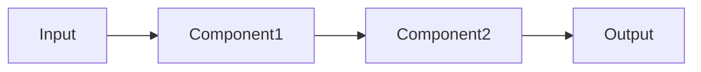

# 📝 ARCHON DOCUMENTATION STANDARD

**Ziel:** Perfekte Code-Navigation für Entwickler & KI Assistants

---

## 🎯 PRINCIPLES

1. **Every file tells a story** - Klarer Kontext, Purpose, Zusammenhänge
2. **Examples over abstract descriptions** - Show, don't just tell
3. **Progressive detail** - High-level overview → Details on demand
4. **Keep it updated** - Code changes = Doc changes

---

## 📁 FILE STRUCTURE

```
python/src/
├── module/
│   ├── __init__.py          # Module overview + exports
│   ├── models.py            # Data models
│   ├── service.py           # Business logic
│   ├── repository.py        # Data access
│   └── README.md            # Module documentation
```

---

## 📋 DOCUMENTATION TEMPLATES

### Python Module Docstring

```python
"""
{Module Name} - {One-line summary}

This module {detailed description of what it does and why}.

Key Concepts:
- {Concept 1}: {Brief explanation}
- {Concept 2}: {Brief explanation}

Usage:
    >>> from src.{module} import {Class}
    >>> obj = {Class}()
    >>> result = await obj.method()

Architecture:
    {Module} fits into the Archon system as follows:
    - Depends on: {modules it imports}
    - Used by: {modules that import it}
    - Events published: {event names}
    - Events subscribed: {event names}

See Also:
    - docs/{RELATED_DOC}.md
    - {Related module}
"""
```

### Class Docstring

```python
class MemoryConsolidator(BaseWorker):
    """
    Promotes important Working Memories to Long-Term storage.
    
    This worker runs periodically and analyzes Working Memory entries
    based on importance scoring, access patterns, and content analysis.
    
    Promotion Criteria:
        - Importance score > {threshold}
        - Access count > {min_access}
        - Contains actionable information
        - Referenced across multiple sessions
    
    Architecture:
        ┌─────────────────┐
        │ Working Memory  │
        │  (7-30 days)    │
        └────────┬────────┘
                 │ analyze
                 ▼
        ┌─────────────────┐
        │ Consolidator    │ ◄── Runs every {interval}
        └────────┬────────┘
                 │ promote
                 ▼
        ┌─────────────────┐
        │ Long-Term Memory│
        │  (permanent)    │
        └─────────────────┘
    
    Example:
        >>> consolidator = MemoryConsolidator(
        ...     interval_seconds=3600,
        ...     importance_threshold=0.7
        ... )
        >>> await consolidator.start()
        # Worker runs every hour
        
        # Check status
        >>> status = consolidator.get_status()
        >>> print(f"Last run: {status.last_run_at}")
    
    Attributes:
        interval_seconds: Consolidation frequency
        importance_threshold: Min score for promotion (0.0-1.0)
        batch_size: Max memories per run
        
    Events Published:
        memory.consolidated:
            Emitted when memories are promoted
            Payload: {user_id, promoted_count, memories: [...]}
            
        memory.consolidation_failed:
            Emitted on error
            Payload: {user_id, error, retryable}
    
    Metrics:
        - archon_consolidation_run_duration_seconds
        - archon_consolidation_memories_promoted_total
        - archon_consolidation_failures_total
    
    See Also:
        - WorkingMemory: Source of candidates
        - LongTermMemory: Destination for promoted items
        - docs/MEMORY.md: Memory system overview
    """
```

### Function Docstring

```python
async def assemble_context(
    self,
    user_id: str,
    session_id: str,
    max_tokens: int = 4000
) -> AssembledContext:
    """
    Assemble context from all memory layers.
    
    Intelligently selects and combines memories from Session, Working,
    and Long-Term layers to fit within token budget.
    
    Selection Strategy:
        1. Recent session messages (prioritized)
        2. High-importance facts (scored)
        3. Relevant working memories (similarity)
        4. Token budget allocation (dynamic)
    
    Args:
        user_id: User identifier
        session_id: Conversation session ID
        max_tokens: Maximum context size (default: 4000)
            Recommended ranges:
            - GPT-4: 4000-8000
            - GPT-3.5: 2000-4000
            - Claude: 8000-16000
    
    Returns:
        AssembledContext containing:
            - messages: List[dict] - Conversation history
            - facts: List[dict] - Important facts
            - total_tokens: int - Actual token count
            - source_counts: dict - Per-layer breakdown
            - status: str - Assembly status (healthy/degraded/cached)
    
    Raises:
        MemoryServiceError: If all memory layers fail
        ValueError: If user_id is empty
    
    Example:
        >>> context = await assembler.assemble_context(
        ...     user_id="user_123",
        ...     session_id="session_abc",
        ...     max_tokens=6000
        ... )
        >>> print(f"Assembled {context.total_tokens} tokens")
        >>> print(f"Sources: {context.source_counts}")
        # Sources: {"session": 12, "working": 5, "longterm": 8}
        
        >>> # Check if degraded
        >>> if context.status == "degraded":
        ...     print("Warning: Running in fallback mode")
    
    Performance:
        - Typical latency: 50-150ms
        - Cached contexts: <10ms
        - Degraded mode: 100-300ms
    
    See Also:
        - ResilientContextAssembler: Production version with circuit breakers
        - AssembledContext model: Return type definition
    """
```

---

## 📄 MODULE README Template

```markdown
# {Module Name}

{One-sentence summary}

## Purpose

{2-3 paragraphs explaining what this module does and why it exists}

## Components

### {Component1}
**File:** `{filename}.py`  
**Purpose:** {what it does}  
**Key Methods:** `method1()`, `method2()`

### {Component2}
**File:** `{filename}.py`  
**Purpose:** {what it does}  
**Key Methods:** `method1()`, `method2()`

## Data Flow



## Usage Examples

### Basic Usage
\`\`\`python
from src.{module} import {Class}

# Example code
\`\`\`

### Advanced Usage
\`\`\`python
# More complex example
\`\`\`

## Configuration

| Setting | Type | Default | Description |
|---------|------|---------|-------------|
| `setting1` | int | 60 | {description} |
| `setting2` | str | "default" | {description} |

## Events

### Published Events
- `{event.name}`: {description}
  - Payload: `{field1, field2}`

### Subscribed Events
- `{event.name}`: {description}

## Metrics

- `archon_{module}_{metric}_total`: {description}
- `archon_{module}_{metric}_seconds`: {description}

## Testing

\`\`\`bash
# Run tests for this module
pytest tests/test_{module}.py -v

# With coverage
pytest tests/test_{module}.py --cov=src.{module}
\`\`\`

## Dependencies

- **Internal:** `src.{other_module}`
- **External:** `{library}=={version}`

## See Also

- [Documentation]({link})
- [Related Module](../other_module/README.md)
```

---

## 🤖 AI INSTRUCTIONS

### .archon/ai-instructions.yaml

```yaml
project:
  name: Archon
  type: AI Agent Platform
  language: Python 3.11+
  framework: FastAPI + React
  
architecture:
  backend: python/src/
  frontend: archon-ui-main/src/
  database: Supabase (Postgres + Row-Level Security)
  cache: Redis
  monitoring: Prometheus + Structlog
  
coding_standards:
  style: PEP 8
  type_checking: mypy --strict
  linting: ruff
  formatting: black
  docstrings: Google style (see DOCUMENTATION_STANDARD.md)
  max_line_length: 100
  
  mandatory:
    - Type hints on all functions
    - Docstrings on all public classes/functions
    - Async/await for I/O operations
    - Use structlog for logging (not print)
    - Pydantic models for data validation
    
  forbidden:
    - Global state / singletons
    - Hard-coded configuration
    - print() statements (use logger)
    - Synchronous I/O in async functions
    - Bare except clauses
    
testing:
  framework: pytest + pytest-asyncio
  coverage_min: 80%
  test_structure: Mirror src/ structure in tests/
  fixtures: tests/fixtures/
  mocks: Use unittest.mock or pytest-mock
  
  rules:
    - Every new feature needs tests
    - Integration tests for critical paths
    - Mock external dependencies
    - Use fixtures for common setups
    
patterns:
  dependency_injection: ✅ Use constructor injection
  circuit_breaker: ✅ For external services (Redis, Postgres, OpenAI)
  retry_logic: ✅ Use tenacity with exponential backoff
  event_driven: ✅ Pub/Sub via EventBus
  repository_pattern: ✅ Separate data access
  
memory_system:
  layers:
    session: Redis-based conversation history
    working: Postgres 7-30 day context
    longterm: Postgres permanent facts
  access: Via ResilientContextAssembler
  
  rules:
    - Always use ResilientContextAssembler (not raw layers)
    - Respect token budgets
    - Track metrics
    - Handle failures gracefully
    
common_tasks:
  add_api_endpoint:
    - Create router in src/api/routers/
    - Add Pydantic request/response models
    - Implement handler logic
    - Add route to main.py
    - Write tests (unit + integration)
    - Update OpenAPI docs
    - Add to docs/API.md
    
  add_agent:
    - Inherit from BaseAgent
    - Implement execute() method
    - Register in AgentRegistry
    - Write tests with mock data
    - Document in docs/AGENTS.md
    - Create template if reusable
    
  add_worker:
    - Inherit from BaseWorker
    - Implement _on_interval() or _on_event()
    - Add to WorkerRunner
    - Test with mock data
    - Track metrics
    - Document behavior
    
  add_migration:
    - Create migration/V{N}_description.sql
    - Test locally with `archon db migrate`
    - Document in migration/README.md
    - Apply to staging
    - Verify rollback works
    - Update schema docs
    
  add_event:
    - Define in src/events/types.py
    - Publish via event_bus.publish()
    - Subscribe via event_bus.subscribe()
    - Document in docs/EVENTS.md
    - Add metrics
    - Test delivery
    
error_handling:
  strategy:
    - Use specific exceptions (not generic Exception)
    - Log with context (structlog)
    - Emit failure events
    - Track error metrics
    - Return meaningful error responses
    
  patterns:
    circuit_breaker: For flaky external services
    retry: For transient failures
    fallback: For degraded mode
    dlq: For guaranteed delivery
    
monitoring:
  logs:
    - Use structlog with structured context
    - Include: user_id, session_id, operation, duration
    - Log levels: debug, info, warning, error, critical
    - Never log sensitive data (passwords, tokens)
    
  metrics:
    - Counter: For counts (requests, errors)
    - Histogram: For durations (latency)
    - Gauge: For current values (queue size)
    - Label carefully (high cardinality = expensive)
    
  health_checks:
    - /health/liveness: Am I alive?
    - /health/readiness: Can I serve traffic?
    - /health/deep: Detailed component status
```

---

## ✅ DOCUMENTATION CHECKLIST

### For Every File

- [ ] Module docstring with purpose & key concepts
- [ ] All public classes documented
- [ ] All public functions documented  
- [ ] Type hints on all functions
- [ ] Usage examples for complex logic
- [ ] Architecture diagram if applicable
- [ ] Dependencies listed
- [ ] Events documented (published/subscribed)
- [ ] Metrics documented

### For Every Module

- [ ] README.md in module directory
- [ ] Purpose & overview
- [ ] Component breakdown
- [ ] Data flow diagram
- [ ] Usage examples (basic + advanced)
- [ ] Configuration options
- [ ] Testing instructions
- [ ] Dependencies (internal + external)

### For Major Features

- [ ] Design doc (docs/{FEATURE}.md)
- [ ] Architecture diagram
- [ ] API documentation
- [ ] Integration guide
- [ ] Migration guide (if breaking changes)
- [ ] Troubleshooting section

---

## 🎯 QUALITY GATES

**Before merging:**

1. ✅ All public APIs documented
2. ✅ Type hints present (mypy passes)
3. ✅ Docstrings follow Google style
4. ✅ Examples provided for complex functions
5. ✅ Tests written (>80% coverage)
6. ✅ README updated if module changes
7. ✅ ai-instructions.yaml updated if patterns change

**Before launch:**

1. ✅ Architecture docs complete
2. ✅ API documentation generated
3. ✅ Development guide written
4. ✅ Deployment guide written
5. ✅ Troubleshooting FAQ created
6. ✅ Video tutorials recorded

---

## 📊 METRICS

Track documentation health:

- Documentation coverage: Files with docstrings / Total files
- Type coverage: mypy --strict pass rate
- API docs: Endpoints documented / Total endpoints
- Examples: Functions with examples / Complex functions

**Target:** >95% across all metrics

---

## 🛠️ TOOLS

### Generate Documentation

```bash
# API docs (OpenAPI)
archon docs api --output docs/api.html

# Code docs (Sphinx)
cd python && sphinx-build -b html docs/ docs/_build/

# Architecture diagrams (from code)
archon docs diagrams --output docs/architecture/

# Coverage report
archon docs coverage
```

### Validate Documentation

```bash
# Check docstring coverage
interrogate python/src/ --fail-under=95

# Check type coverage
mypy python/src/ --strict

# Validate examples (run doctest)
pytest --doctest-modules python/src/

# Check broken links
archon docs check-links
```

---

**Last Updated:** 2025-11-29  
**Status:** Living Document - Update as patterns evolve
